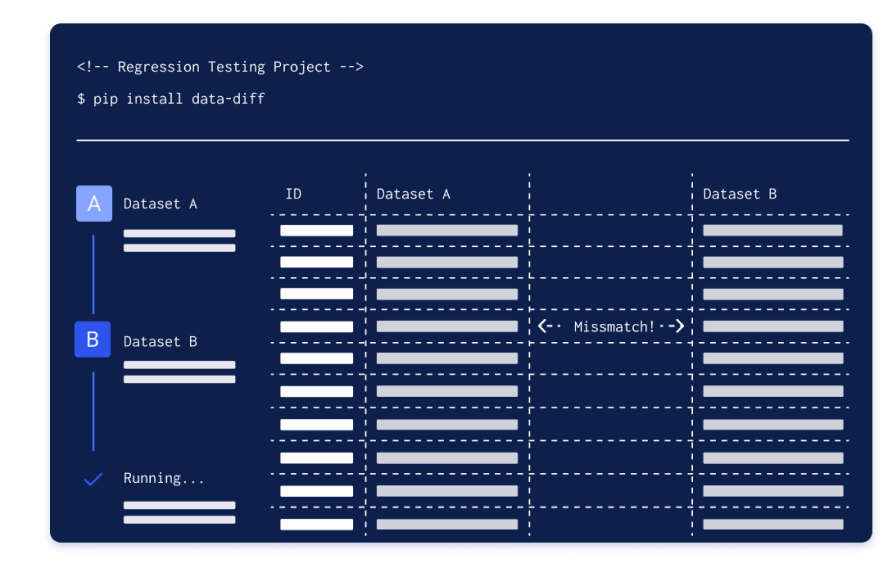

<p align="center">
    <a href="https://datafold.com/"></a>
</p>

<h2 align="center">
data-diff: Compare datasets fast, within or across SQL databases


</h2>
<br>

> [Join our live virtual lab series to learn how to set it up!](https://www.datafold.com/virtual-hands-on-lab)

# What's a Data Diff?
A data diff is the value-level comparison between two tables—used to identify critical changes to your data and guarantee data quality.

There is a lot you can do with data-diff: you can test SQL code by comparing development or staging environment data to production, or compare source and target data to identify discrepancies when moving data between databases.

# Use Cases

### Data Migration & Replication Testing
data-diff is a powerful tool for comparing data when you're moving it between systems. Use it to ensure data accuracy and identify discrepancies during tasks like:
- **Migrating** to a new data warehouse (e.g., Oracle > Snowflake)
- **Converting SQL** to a new transformation framework (e.g., stored procedures > dbt)
- Continuously **replicating data** from an OLTP database to OLAP data warehouse (e.g., MySQL > Redshift)

### Data Development Testing 
When developing SQL code, data-diff helps you validate and preview changes by comparing data between development/staging environments and production. Here's how it works:
1. Make a change to your SQL code
2. Run the SQL code to create a new dataset
3. Compare this dataset with its production version or other iterations

# dbt Integration
  <p align="center">
  
  </p> 

data-diff integrates with [dbt Core](https://github.com/dbt-labs/dbt-core) to seamlessly compare local development to production datasets.

Learn more about how data-diff works with dbt:
* Read our docs to get started with [data-diff & dbt](https://docs.datafold.com/development_testing/cli) or :eyes: **watch the [4-min demo video](https://www.loom.com/share/ad3df969ba6b4298939efb2fbcc14cde)**
* dbt Cloud users should check out [Datafold's out-of-the-box deployment testing integration](https://www.datafold.com/data-deployment-testing)
* Get support from the dbt Community Slack in [#tools-datafold](https://getdbt.slack.com/archives/C03D25A92UU)


# Getting Started

### ⚡ Validating dbt model changes between dev and prod
Looking to use data-diff in dbt development? 

Development testing with Datafold enables you to see the impact of dbt code changes on data as you write the code, whether in your IDE or CLI. 

 Head over to [our `data-diff` + `dbt` documentation](https://docs.datafold.com/development_testing/how_it_works) to get started with a development testing workflow!

### 🔀 Compare data tables between databases
1. Install `data-diff` with adapters

To compare data between databases, install `data-diff` with specific database adapters. For example, install it for PostgreSQL and Snowflake like this:

```
pip install data-diff 'data-diff[postgresql,snowflake]' -U
```

2. Run `data-diff` with connection URIs

Then, we compare tables between PostgreSQL and Snowflake using the hashdiff algorithm:

```bash
data-diff \
  postgresql://<username>:'<password>'@localhost:5432/<database> \
  <table> \
  "snowflake://<username>:<password>@<account>/<DATABASE>/<SCHEMA>?warehouse=<WAREHOUSE>&role=<ROLE>" \
  <TABLE> \
  -k <primary key column> \
  -c <columns to compare> \
  -w <filter condition>
```
3. Set up your configuration 

You can use a `toml` configuration file to run your `data-diff` job. In this example, we compare tables between MotherDuck (hosted DuckDB) and Snowflake using the hashdiff algorithm:

```toml
## DATABASE CONNECTION ##
[database.duckdb_connection] 
  driver = "duckdb"
  # filepath = "datafold_demo.duckdb" # local duckdb file example
  # filepath = "md:" # default motherduck connection example
  filepath = "md:datafold_demo?motherduck_token=${motherduck_token}" # API token recommended for motherduck connection

[database.snowflake_connection]
  driver = "snowflake"
  database = "DEV"
  user = "sung"
  password = "${SNOWFLAKE_PASSWORD}" # or "<PASSWORD_STRING>"
  # the info below is only required for snowflake
  account = "${ACCOUNT}" # by33919
  schema = "DEVELOPMENT"
  warehouse = "DEMO"
  role = "DEMO_ROLE"

## RUN PARAMETERS ##
[run.default]
  verbose = true

## EXAMPLE DATA DIFF JOB ##
[run.demo_xdb_diff]
  # Source 1 ("left")
  1.database = "duckdb_connection"
  1.table = "development.raw_orders"

  # Source 2 ("right")
  2.database = "snowflake_connection"
  2.table = "RAW_ORDERS" # note that snowflake table names are case-sensitive

  verbose = false
```
4. Run your `data-diff` job

Make sure to export relevant environment variables as needed. For example, we compare data based on the earlier configuration:

```bash

# export relevant environment variables, example below
export motherduck_token=<MOTHERDUCK_TOKEN>

# run the configured data-diff job
data-diff --conf datadiff.toml \
  --run demo_xdb_diff \
  -k "id" \
  -c status

# output example
- 1, completed
+ 1, returned
```

5. Review the output

After running your data-diff job, review the output to identify and analyze differences in your data.

Check out [documentation](https://docs.datafold.com/reference/open_source/cli) for the full command reference.


# Supported databases


| Database      | Status | Connection string                                                                                                                   |
|---------------|-------------------------------------------------------------------------------------------------------------------------------------|-------------------------------------------------------------------------------------------------------------------------------------|
| PostgreSQL >=10 |  🟢   | `postgresql://<user>:<password>@<host>:5432/<database>`                                                                             |
| MySQL         |  🟢     | `mysql://<user>:<password>@<hostname>:5432/<database>`                                                                              |
| Snowflake     |  🟢     | `"snowflake://<user>[:<password>]@<account>/<database>/<SCHEMA>?warehouse=<WAREHOUSE>&role=<role>[&authenticator=externalbrowser]"` |
| BigQuery      |  🟢     | `bigquery://<project>/<dataset>`                                                                                                    |
| Redshift      |  🟢     | `redshift://<username>:<password>@<hostname>:5439/<database>`                                                                       |
| DuckDB        |  🟢   | `duckdb://<filepath>`                                                                                          |
| MotherDuck        |  🟢   | `duckdb://<filepath>`                                                                                                   |
| Oracle        |  🟡   | `oracle://<username>:<password>@<hostname>/servive_or_sid`                                                                          |
| Presto        |  🟡   | `presto://<username>:<password>@<hostname>:8080/<database>`                                                                         |
| Databricks    |  🟡   | `databricks://<http_path>:<access_token>@<server_hostname>/<catalog>/<schema>`                                                      |
| Trino         |  🟡   | `trino://<username>:<password>@<hostname>:8080/<database>`                                                                          |
| Clickhouse    |  🟡   | `clickhouse://<username>:<password>@<hostname>:9000/<database>`                                                                     |
| Vertica       |  🟡   | `vertica://<username>:<password>@<hostname>:5433/<database>`                                                                        |
| ElasticSearch |  📝    |                                                                                                                                     |
| Planetscale   |  📝    |                                                                                                                                     |
| Pinot         |  📝    |                                                                                                                                     |
| Druid         |  📝    |                                                                                                                                     |
| Kafka         |  📝    |                                                                                                                                     |
| SQLite        |  📝    |                                                                                                                                     |

* 🟢: Implemented and thoroughly tested.
* 🟡: Implemented, but not thoroughly tested yet.
* ⏳: Implementation in progress.
* 📝: Implementation planned. Contributions welcome.

Your database not listed here?

- Contribute a [new database adapter](https://github.com/datafold/data-diff/blob/master/docs/new-database-driver-guide.rst) – we accept pull requests!
- [Get in touch](https://www.datafold.com/demo) about enterprise support and adding new adapters and features


<br>

# How it works

`data-diff` efficiently compares data using two modes:

1. **`joindiff`**: Ideal for comparing data within the same database, utilizing outer joins for efficient row comparisons. It relies on the database engine for computation and has consistent performance.

2. **`hashdiff`**: Recommended for comparing datasets across different databases or large tables with minimal differences. It uses hashing and binary search, capable of diffing data across distinct database engines.

For detailed algorithm and performance insights, explore [here](https://github.com/datafold/data-diff/blob/master/docs/technical-explanation.md).

## Contributors

We thank everyone who contributed so far! 

We'd love to see your face here: [Contributing Instructions](CONTRIBUTING.md)

<a href="https://github.com/datafold/data-diff/graphs/contributors">
  
</a>

<br>

## Analytics

* [Usage Analytics & Data Privacy](https://github.com/datafold/data-diff/blob/master/docs/usage_analytics.md)

<br>

## License

This project is licensed under the terms of the [MIT License](https://github.com/datafold/data-diff/blob/master/LICENSE).
